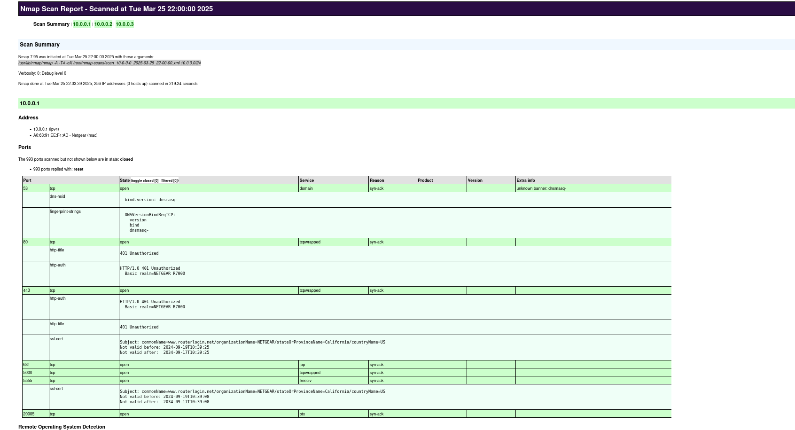

# Nmap Subnet Scanner

[](https://www.python.org/)
[

A simple but effective Python script that uses `nmap` to scan a `/24` subnet and outputs results in both XML and HTML format.

---

## 🔧 Features

- Automatically detects your home directory, even when run with `sudo`
- Saves results to `~/nmap-scans` by default
- Outputs clean XML and HTML reports
- Uses `xsltproc` to generate a readable HTML version
- Great for pentesters, sysadmins, and security students

---

## 🚀 Usage

```bash
sudo python3 nmap_scan.py
```

Then enter your base IP when prompted:

```text
Enter the IP base (e.g. 192.168.1.0): 10.0.0.0
```

---

## 📁 Output

Scan results are saved to:

```
~/nmap-scans/
```

With filenames like:

```
scan_10-0-0-0_2025-03-25_22-00-00.xml
scan_10-0-0-0_2025-03-25_22-00-00.html
```

Open the `.html` file in your browser to view results in a clean and readable format.

---

## 🔒 Requirements

- Python 3
- `nmap` installed
- `xsltproc` installed

Install `xsltproc` on Debian/Kali-based systems:

```bash
sudo apt install xsltproc
```

---

## 📜 License

MIT License
